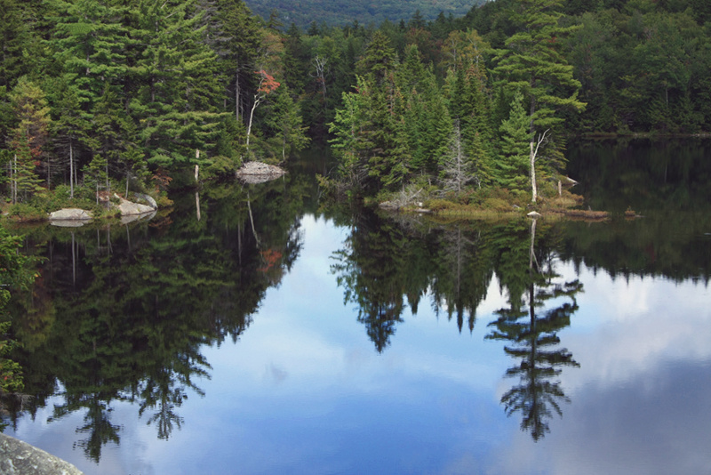

# Vermont Lake Health
Project provides a collection of analysis related to lake water health in the state of Vermont, USA. The dataset contains decades of chemical tests of lake water across more than 400 lakes in the state. By combining chemical measurements with land use data, population density, and geospatial data, we hope to understand how lake health has developed over time and with respect to geographic region.

